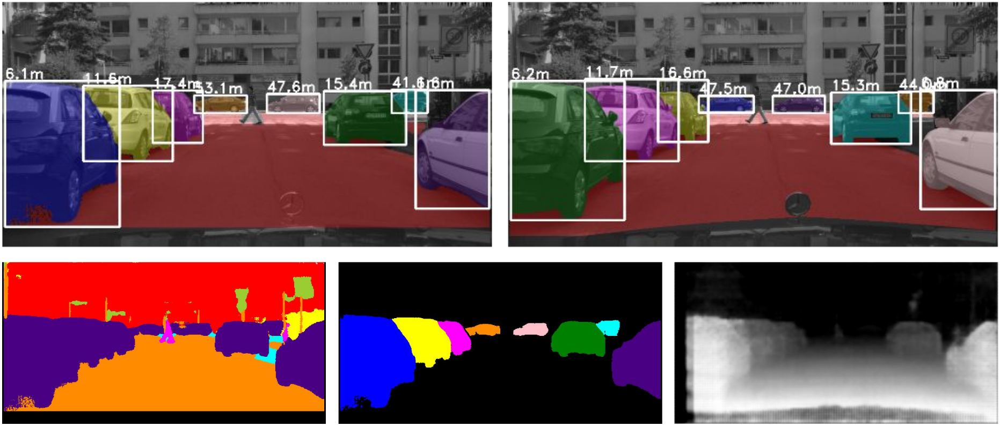

# Fast Scene Understanding

Torch implementation for simultaneous image segmentation, instance segmentation and single image depth. Two videos can be found [here](https://www.youtube.com/watch?v=55ElRh-g_7o) and [here](https://www.youtube.com/watch?v=FB_SZIKyX50).

Example:



If you use this code for your research, please cite our papers: 

[Fast Scene Understanding for Autonomous Driving](https://arxiv.org/abs/1708.02550)  
[Davy Neven](https://www.kuleuven.be/wieiswie/nl/person/00104627), [Bert De Brabandere](https://www.kuleuven.be/wieiswie/nl/person/00096935), [Stamatios Georgoulis](http://homes.esat.kuleuven.be/~sgeorgou/), [Marc Proesmans](https://www.kuleuven.be/wieiswie/nl/person/00003449) and [Luc Van Gool](https://www.vision.ee.ethz.ch/en/members/get_member.cgi?id=1)  
Published at "Deep Learning for Vehicle Perception", workshop at the IEEE Symposium on Intelligent Vehicles 2017

and

[Semantic Instance Segmentation with a Discriminative Loss Function](https://arxiv.org/abs/1708.02551)  
[Bert De Brabandere](https://www.kuleuven.be/wieiswie/nl/person/00096935), [Davy Neven](https://www.kuleuven.be/wieiswie/nl/person/00104627) and [Luc Van Gool](https://www.vision.ee.ethz.ch/en/members/get_member.cgi?id=1)  
Published at "Deep Learning for Robotic Vision", workshop at CVPR 2017

# Setup

## Prerequisites

Torch dependencies: 

- [Torchnet](https://github.com/torchnet/torchnet)
- [OptNet](https://github.com/fmassa/optimize-net)
- CUDA + cuDNN enabled GPU

Data dependencies: 

- [Cityscapes](https://www.cityscapes-dataset.com/) + [scripts](https://github.com/mcordts/cityscapesScripts)

Download Cityscapes and run the script `createTrainIdLabelImgs.py` and `createTrainIdInstanceImgs.py` to create annotations based on the training labels. Make sure that the folder is named *cityscapes*

Afterwards create following txt files: 

```
cd CITYSCAPES_FOLDER

ls leftImg8bit/train/*/*.png > trainImages.txt
ls leftImg8bit/val/*/*.png > valImages.txt

ls gtFine/train/*/*labelTrainIds.png > trainLabels.txt
ls gtFine/val/*/*labelTrainIds.png.png > valLabels.txt

ls gtFine/train/*/*instanceTrainIds.png > trainInstances.txt
ls gtFine/val/*/*instanceTrainIds.png.png > valInstances.txt

ls disparity/train/*/*.png > trainDepth.txt
ls disparity/val/*/*.png.png > valDepth.txt

```

## Download pretrained model

To download both the pretrained segmentation model for training and a trained model for testing, run: 

```sh download.sh```

# Test pretrained model

To test the pretrained model, make sure you downloaded both the pretrained model and the Cityscapes dataset (+ scripts and txt files, see above). After, run:

```qlua test.lua -data_root CITYSCAPES_ROOT``` with *CITYSCAPES_ROOT* the folder where cityscapes is located. For other options, see *test_opts.lua*

# Train your own model
To train your own model, run: 

```qlua main.lua -data_root CITYSCAPES_ROOT -save true -directory PATH_TO_SAVE```

For other options, see *opts.lua*

# Tensorflow code
A third party tensorflow implementation of our loss function applied to lane instance segmentation is available from [Hanqiu Jiang's github repository](https://github.com/hq-jiang/instance-segmentation-with-discriminative-loss-tensorflow).
